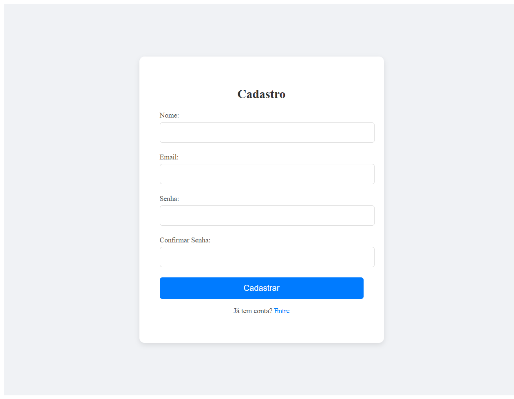

<a id="readme-top"></a>

<div> 
  <a href="https://www.youtube.com/@OazizDigital/videos" target="_blank"></a>
  <a href = "mailto:almeidaleo.dev@gmail.com"></a>
  <a href="https://www.linkedin.com/in/almeidaleo-dev/" target="_blank"></a> 
</div>

<br />

<!-- PROJECT LOGO -->
<div align="center">
  <a href="https://github.com/AlmeidaLeoDev/EventosPro">
    
  </a>
  <h3 align="center">EVENTOS PRO</h3>
</div>

_Read this in another language:_
[_Portuguese_](docs/README.pt.md)

  <div align="center">
    Web-based event calendar system
  </div>

  <div align="center">
    <a href="#about-the-project"><strong>Explore the docs »</strong></a>
  
  <p>
    <br />
    <a href="#usage">View Demo</a>
    &middot;
    <a href="https://github.com/AlmeidaLeoDev/EventosPro/issues/new?labels=bug&template=bug-report.md">Report Bug</a>
    &middot;
    <a href="https://github.com/AlmeidaLeoDev/EventosPro/issues/new?labels=bug&template=feature-request.md">Request Feature</a>
  </p>
</div>


<!-- TABLE OF CONTENTS -->
<details>
  <summary>Table of Contents</summary>
  <ol>
    <li>
      <a href="#about-the-project">About The Project</a>
      <ul>
        <li><a href="#built-with">Built With</a></li>
      </ul>
    </li>
    <li>
      <a href="#getting-started">Getting Started</a>
      <ul>
        <li><a href="#prerequisites">Prerequisites</a></li>
        <li><a href="#installation">Installation</a></li>
      </ul>
    </li>
    <li><a href="#usage">Usage</a></li>
    <li>
      <a href="#contributing">Contributing</a>
      <ul>
        <li><a href="#top-contributors">Top contributors</a></li>
      </ul>
    </li>
    <li><a href="#credits">Credits</a></li>
    <li><a href="#license">License</a></li>
  </ol>
</details>


<!-- ABOUT THE PROJECT -->
## About The Project

Event management platform with secure authentication.

Main Objectives:

* Provide an interactive calendar for event management
* Implement a secure JWT authentication system with email confirmation
* Allow the creation, reading, updating, and deletion of events while keeping the data always up-to-date.

</br>

### Built With

**Front-End**

* [](https://developer.mozilla.org/en-US/docs/Web/JavaScript)
* [](https://react.dev/)
* [](https://developer.mozilla.org/en-US/docs/Web/HTML)
* [](https://developer.mozilla.org/en-US/docs/Web/CSS)

**Back-End**

* [](https://learn.microsoft.com/en-us/aspnet/core/?view=aspnetcore-9.0)
* [](https://learn.microsoft.com/en-us/dotnet/csharp/)
* [](https://learn.microsoft.com/en-us/ef/)

**Infrastructure**

* [](https://learn.microsoft.com/en-us/sql/sql-server/?view=sql-server-ver16)

<br />
<p align="left">(<a href="#readme-top">Back to top</a>)</p>
<br />


<!-- GETTING STARTED -->
## Getting Started

Instructions on how you can set up your project locally.

### Prerequisites

* Git: To clone the repository.
* Node.js and npm/yarn: Required for front-end development.
* .NET SDK: To build and run the back-end (ASP.NET Core).
* Database: A running instance of your database (Microsoft SQL Server).
* Email Service Credentials: SMTP settings for email confirmation and notifications.
* MailKit: For handling email functionalities such as sending confirmation emails and notifications.
* FullCalendar: JavaScript library for implementing an interactive calendar interface for event management.


### Installation

Below you will find instructions on how to install and configure your application.

**1. Clone the Repository**

Open your terminal and run:

```bash
git clone https://github.com/AlmeidaLeoDev/EventosPro
```
Then navigate to the project directory:
```bash
cd EventosPro
```
<p></p>

**2. Configure the Back-End**

Set Up Environment Variables:

Create a file (e.g., .env or use your preferred method for environment configuration) in the back-end directory with the following variables:
- JWT_SECRET=your_jwt_secret_key
- DB_CONNECTION_STRING=your_database_connection_string
- SMTP_HOST=your_smtp_host
- SMTP_PORT=your_smtp_port
- SMTP_USER=your_smtp_username
- SMTP_PASS=your_smtp_password
<p></p>

**3. Build and Run the Back-End**

Navigate to the back-end folder (if separate) and run:

```bash
dotnet build
```
```bash
dotnet run
```
<p></p>

**4. Configure the Front-End**

Navigate to the front-end directory (typically named client or similar):

```bash
cd client
npm install
```
Then, install FullCalendar packages:
```bash
npm install @fullcalendar/core @fullcalendar/daygrid
```
Integrate FullCalendar in your application by importing and configuring it in your React (or other JavaScript framework) component.

Run the Front-End:

Start the development server:
```bash
npm start
```
<p></p>

**5. Verify the Setup**
* Interactive Calendar: Open the application and confirm that the interactive calendar loads correctly.
* Authentication: Test the JWT-based authentication system by signing up and confirming the account via email.

<br />
<p align="left">(<a href="#readme-top">Back to top</a>)</p>
<br />


<!-- USAGE -->
## Usage

Demonstration of how the project can be used

<div align="left">

**1. Registration and Authentication**
  
* The user accesses the homepage and clicks on "Sign up."



* The user fill in your details (name, email, password) and submit the form.
* A confirmation email is sent (via MailKit).
* The user clicks the confirmation link to activate your account.
* Now, you can log in using their credentials (JWT Authentication).
<p></p>

**2. If you already have an account, you can click on "Recover password."**

* In this case, the instructions for changing your password will be sent to your email.


<p></p>

**3. Creating an Event**

* After logging in, the user accesses the dashboard


* In the dashborad the user clicks on "Create Event".
* He fill in details such as date and description.
* The event is saved in the database and displayed in FullCalendar.


<p></p>

**4. Managing Events**

* The user can edit event details or delete unwanted events.


</div>

<br />
<p align="left">(<a href="#readme-top">Back to top</a>)</p>
<br />


<!-- CONTRIBUTING -->
## Contributing

Contributions are what make the open source community such an amazing place to learn, inspire, and create. Any contributions you make are **greatly appreciated**.

If you have a suggestion that would make this better, please fork the repository and create a pull request. You can also simply open an issue with the tag "enhancement".
Don't forget to give the project a star! Thanks again!

1. Fork the Project
2. Create your Feature Branch (`git checkout -b feature/AmazingFeature`)
3. Commit your Changes (`git commit -m 'Add some AmazingFeature'`)
4. Push to the Branch (`git push origin feature/AmazingFeature`)
5. Open a Pull Request

### Top contributors

<table>
  <tr>
    <td align="center">
      <a href="https://www.linkedin.com/in/almeidaleo-dev/" target="_blank">
        <br>
        <sub>
          <b>Leonardo Almeida</b>
        </sub>
      </a>
    </td>
</table>

<br />
<p align="left">(<a href="#readme-top">Back to top</a>)</p>
<br />


## Credits

This README was inspired by and developed based on the work of [Best-README-Template](https://github.com/othneildrew/Best-README-Template/tree/main), created by [emargi - 
Mohamad Reza] and on the work of [Readme-Templates](https://github.com/Fernanda-Kipper/Readme-Templates), created by [Fernanda-Kipper - 
Fernanda Kipper
]

Thank you for your excellent content and contribution to the open source community!


## License

This project is under [MIT](/LICENSE)
