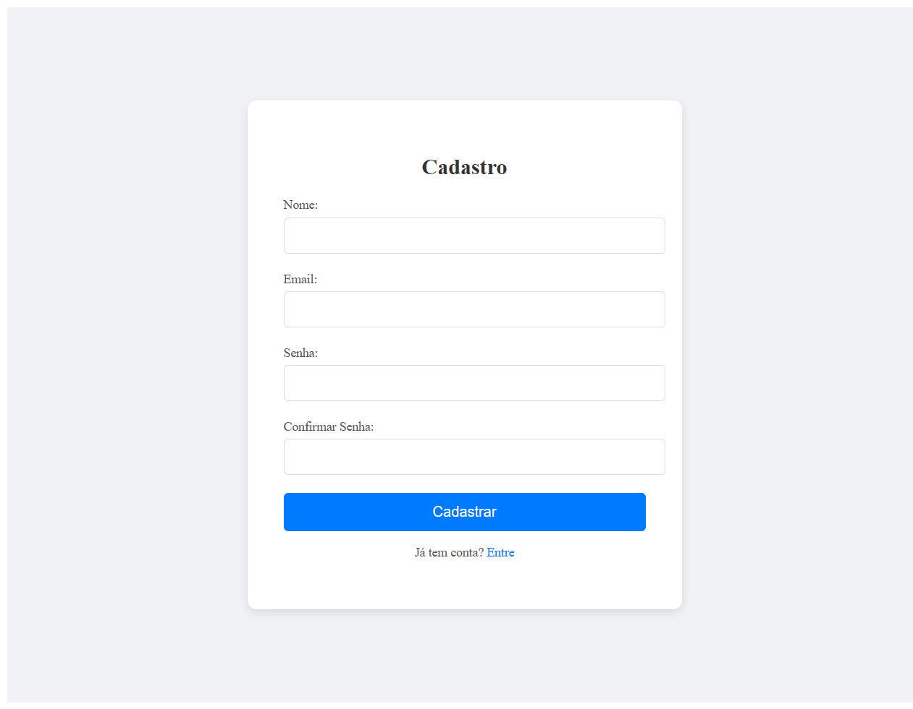
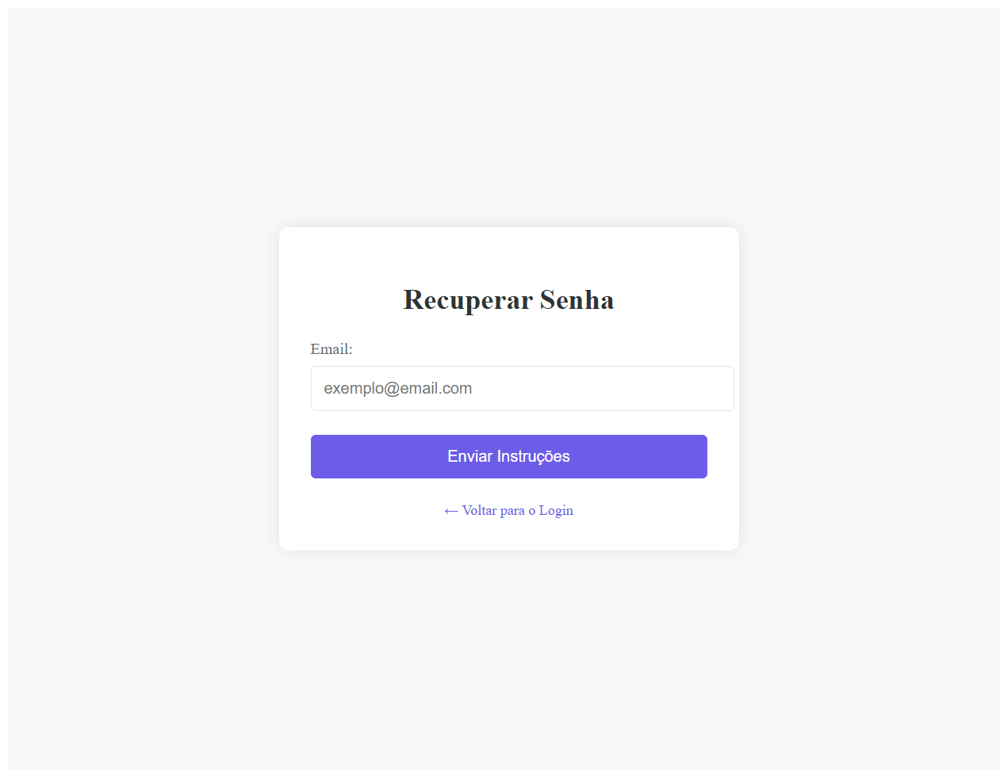
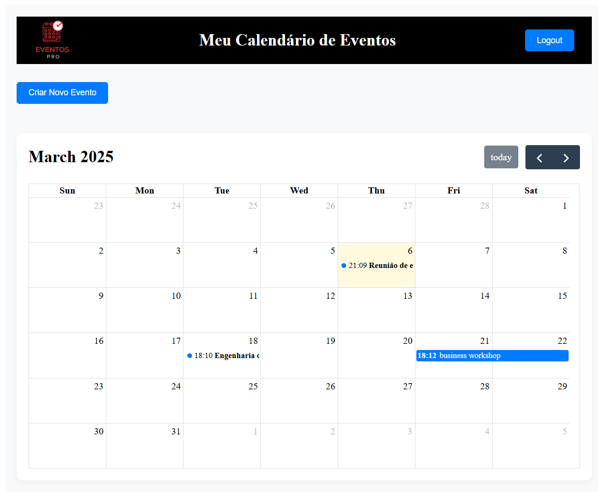
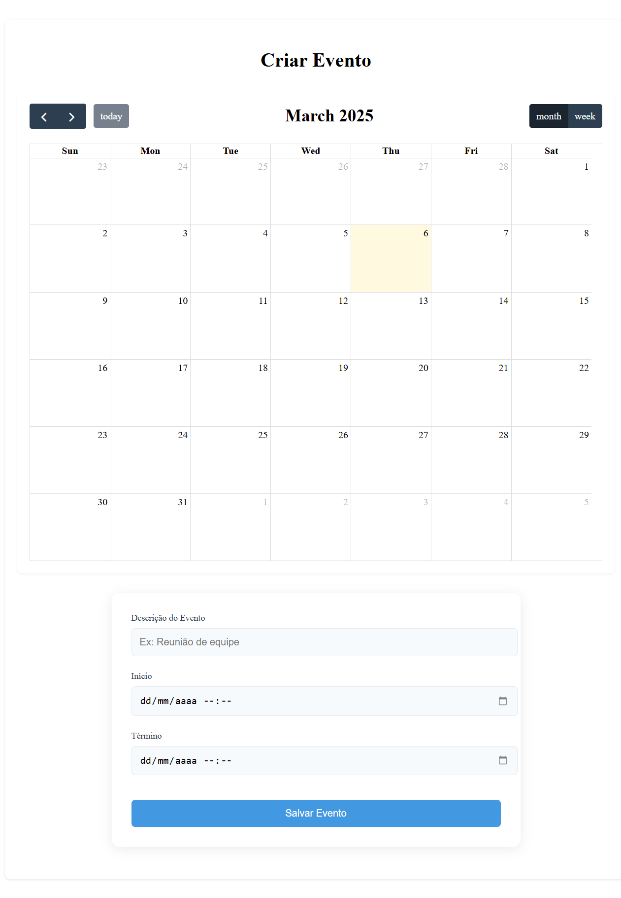
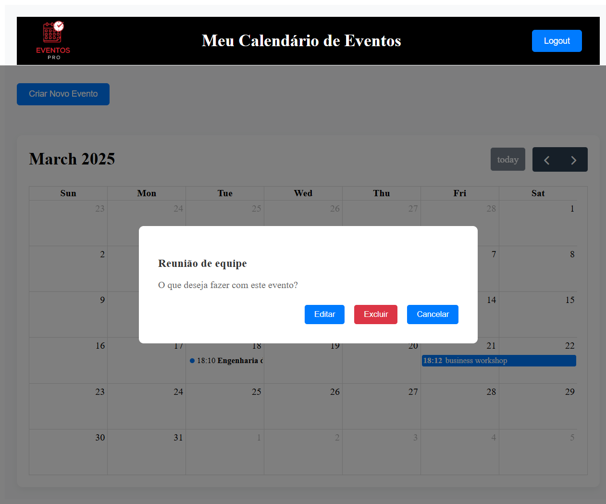
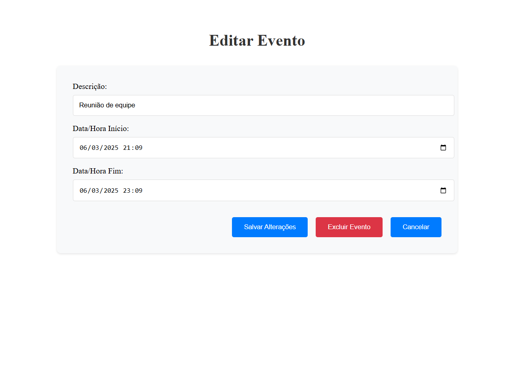

<a id="readme-top"></a>

<div> 
  <a href="https://www.youtube.com/@OazizDigital/videos" target="_blank"></a>
  <a href = "mailto:almeidaleo.dev@gmail.com"></a>
  <a href="https://www.linkedin.com/in/almeidaleo-dev/" target="_blank"></a> 
</div>

</br>

<!-- LOGO DO PROJETO -->
<div align="center">
  <a href="https://github.com/AlmeidaLeoDev/EventosPro">
    
  </a>
  <h3 align="center">EVENTOS PRO</h3>
</div>

_Leia isto em outro idioma:_
[_Inglês_](../README.md)

<div align="center">
 Sistema de calendário de eventos baseado na web
</div>

<div align="center">
  <a href="#sobre-o-projeto"><strong>Explore os documentos »</strong></a>
  
  <p>
  <br />
  <a href="#uso">Ver demonstração</a>
  &middot;
  <a href="https://github.com/AlmeidaLeoDev/EventosPro/issues/new?labels=bug&template=bug-report.md">Reportar Bug</a>
  &middot;
  <a href="https://github.com/AlmeidaLeoDev/EventosPro/issues/new?labels=bug&template=feature-request.md">Solicitar Feature</a>
  </p>
</div>


<!-- ÍNDICE -->
<details>
  <summary>Table of Contents</summary>
  <ol>
    <li>
      <a href="#sobre-o-projeto">Sobre o projeto</a>
      <ul>
        <li><a href="#feito-com">Feito com</a></li>
      </ul>
    </li>
    <li>
      <a href="#começando">Começando</a>
      <ul>
        <li><a href="#pré-requisitos">pré-requisitos</a></li>
        <li><a href="#instalação">Instalação</a></li>
      </ul>
    </li>
    <li><a href="#uso">Uso</a></li>
    <li>
      <a href="#contribuindo">Contribuindo</a>
      <ul>
        <li><a href="#principais-colaboradores">Principais colaboradores</a></li>
      </ul>
    </li>
    <li><a href="#créditos">Créditos</a></li>
    <li><a href="#licença">Licença</a></li>
  </ol>
</details>


<!-- SOBRE O PROJETO -->
## Sobre o projeto

Plataforma de gerenciamento de eventos com autenticação segura.

Objetivos principais:

* Fornecer um calendário interativo para gerenciamento de eventos
* Implementar um sistema de autenticação seguro com JWT e confirmação por e-mail
* Permitir a criação, leitura, atualização e exclusão de eventos, mantendo os dados sempre atualizados


### Feito com

**Front-End**

* [](https://developer.mozilla.org/en-US/docs/Web/JavaScript)
* [](https://react.dev/)
* [](https://developer.mozilla.org/en-US/docs/Web/HTML)
* [](https://developer.mozilla.org/en-US/docs/Web/CSS)

**Back-End**

* [](https://learn.microsoft.com/en-us/aspnet/core/?view=aspnetcore-9.0)
* [](https://learn.microsoft.com/en-us/dotnet/csharp/)
* [](https://learn.microsoft.com/en-us/ef/)

**Infrastructure**

* [](https://learn.microsoft.com/en-us/sql/sql-server/?view=sql-server-ver16)

<br />
<p align="left">(<a href="#readme-top">Voltar ao topo</a>)</p>
<br />


<!-- COMEÇANDO -->
## Começando

Instruções sobre como você pode configurar seu projeto localmente.

### pré-requisitos

* Git: Para clonar o repositório.
* Node.js e npm/yarn: Necessários para o desenvolvimento front-end.
* .NET SDK: Para compilar e executar o back-end (ASP.NET Core).
* Banco de Dados: Uma instância em execução do seu banco de dados (Microsoft SQL Server).
* Credenciais do Serviço de E-mail: Configurações SMTP para confirmação de e-mail e notificações.
* MailKit: Para lidar com funcionalidades de e-mail, como envio de e-mails de confirmação e notificações.
* FullCalendar: Biblioteca JavaScript para implementar uma interface de calendário interativo para o gerenciamento de eventos.


### Instalação

Abaixo você encontrará instruções sobre como instalar e configurar sua aplicação.

**1. Clonar o repositório**

Abrir seu terminal e executar:

```bash
git clone https://github.com/AlmeidaLeoDev/EventosPro
```
Em seguida, navegue até o diretório do projeto:
```bash
cd EventosPro
```
<p></p>

**2. Configurar o Back-End**

Configurar variáveis de ambiente:

Criar um arquivo (e.g., .env ou usar seu método favorito para configuração do ambiente) no diretório do back-end com as seguintes variáveis:
- JWT_SECRET=your_jwt_secret_key
- DB_CONNECTION_STRING=your_database_connection_string
- SMTP_HOST=your_smtp_host
- SMTP_PORT=your_smtp_port
- SMTP_USER=your_smtp_username
- SMTP_PASS=your_smtp_password
<p></p>

**3. Compilar e Executar o Back-End**

Navegue para a pasta back-end (se separada) e execute:

```bash
dotnet build
```
```bash
dotnet run
```
<p></p>

**4. Configurar o Front-End**

Navegar para o diretório front-end (normalmente denominado cliente ou similar):

```bash
cd client
npm install
```
Em seguida, instale os pacotes FullCalendar:
```bash
npm install @fullcalendar/core @fullcalendar/daygrid
```
Integre FullCalendar na sua aplicação importando e configurando-o em seu React (ou outro JavaScript framework) component.

Executar o Front-End:

Inicie o servidor de desenvolvimento:
```bash
npm start
```
<p></p>

**5. Verifique a configuração**
* Calendário interativo: Abra a aplicação e confirme que o calendário interativo carrega corretamente.
* Autenticação: Teste o sistema de autenticação baseado em JWT inscrevendo-se e confirmando a conta por email.

<br />
<p align="left">(<a href="#readme-top">Voltar ao topo</a>)</p>
<br />


<!-- USO -->
## Uso

Demonstração de como o projeto pode ser usado

<div align="left">

**1. Registro e autenticação**
  
* O usuário acessa a página principal e clica em "Cadastre-se."



* Eles preenchem seus dados (nome, e-mail, senha) e enviam o formulário.
* Um e-mail de confirmação é enviado (via MailKit).
* O usuário clica no link de confirmação para ativar sua conta.
* Agora, ele pode fazer login usando suas credenciais (Autenticação JWT).
<p></p>

**2. Se você já tem uma conta, você pode clicar em "Recuperar senha".**

* Nesse caso, as instruções para mudança da sua senha vão ser enviadas para o seu email.


<p></p>

**3. Criando um Evento**

* Após fazer o login o usuário acessa o painel.



* No painel, o usuário clica em "Criar Evento".
* Ele preenche os detalhes, como data e descrição.
* O evento é salvo no banco de dados e exibido no FullCalendar.


<p></p>

**4. Gerenciando eventos**

* O usuário pode editar os detalhes do evento ou deletar eventos indesejados.




</div>

<br />
<p align="left">(<a href="#readme-top">Voltar ao topo</a>)</p>
<br />


<!-- CONTRIBUINDO -->
## Contribuindo

As contribuições são o que tornam a comunidade de código aberto um lugar incrível para aprender, inspirar e criar. Qualquer contribuição que você fizer será muito apreciada.

Se você tiver uma sugestão que possa melhorar, por favor, faça um fork do repositório e crie um pull request. Você também pode simplesmente abrir uma issue com a tag "enhancement".
Não se esqueça de dar uma estrela ao projeto! Obrigado novamente!

1. Faça o Fork do Projeto
2. Crie sua Branch de Funcionalidade (`git checkout -b feature/AmazingFeature`)
3. Faça o Commit das suas Alterações (`git commit -m 'Adicionar alguma AmazingFeature'`)
4. Envie para a Branch (`git push origin feature/AmazingFeature`)
5. Abra um Pull Request

### Principais colaboradores:

<table>
  <tr>
    <td align="center">
      <a href="https://www.linkedin.com/in/almeidaleo-dev/" target="_blank">
        <br>
        <sub>
          <b>Leonardo Almeida</b>
        </sub>
      </a>
    </td>
</table>

<br />
<p align="left">(<a href="#readme-top">Voltar ao topo</a>)</p>
<br />


## Créditos

Este README foi inspirado e desenvolvido com base no trabalho de [Best-README-Template](https://github.com/othneildrew/Best-README-Template/tree/main), criado por [othneildrew - 
Othneil Drew] e no trabalho de [Readme-Templates](https://github.com/Fernanda-Kipper/Readme-Templates), criado por [Fernanda-Kipper - 
Fernanda Kipper
]

Agradecemos pelo excelente conteúdo e pela contribuição para a comunidade open source!

<br />


## Licença

Este projeto está sob licença do [MIT](../LICENSE)
